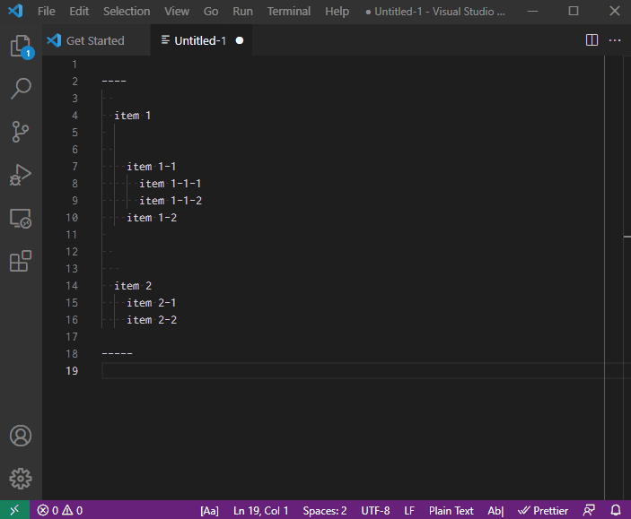
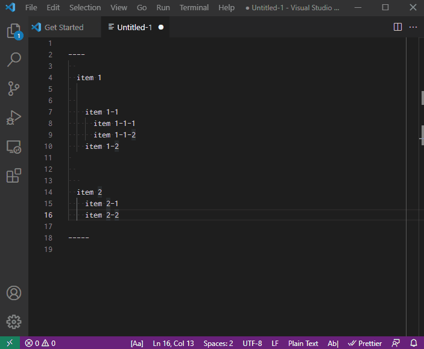
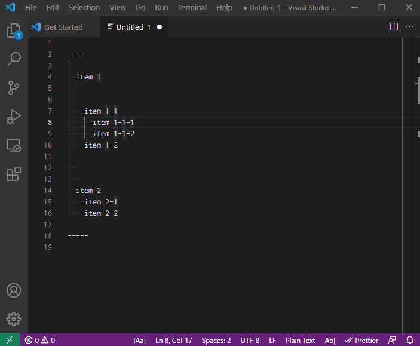

# VSCode extension - Control Blank Line

[![Version][version-badge]][marketplace]
[![Ratings][ratings-badge]][marketplace-ratings]
[![Installs][installs-badge]][marketplace]
[![License][license-badge]][license]

This Control Blank Line extension has the ability to remove, increase, decrease, and combine blank lines into one line.

## Usage

Following commands are available:

- `Control Blank Line : Combine Blank Lines into One Line`
- `Control Blank Line : Delete Blank Lines`
- `Control Blank Line : Decrease Blank Lines by One`
- `Control Blank Line : Increase Blank Lines by One`

## Preview

Control Blank Line : Combine Blank Lines into One Line

Control Blank Line : Delete Blank Lines

Control Blank Line : Decrease Blank Lines by One

Control Blank Line : Increase Blank Lines by One

## Install

Search for "Control Blank Line" in the Marketplace  
https://marketplace.visualstudio.com/vscode

or here  
https://marketplace.visualstudio.com/items?itemName=SatoshiYamamoto.vscode-control-blank-line

## License

Released under the [MIT License][license].

[version-badge]: https://vsmarketplacebadge.apphb.com/version/SatoshiYamamoto.vscode-control-blank-line.svg
[ratings-badge]: https://vsmarketplacebadge.apphb.com/rating/SatoshiYamamoto.vscode-control-blank-line.svg
[installs-badge]: https://vsmarketplacebadge.apphb.com/installs/SatoshiYamamoto.vscode-control-blank-line.svg
[license-badge]: https://img.shields.io/github/license/standard-software/vscode-control-blank-line.svg

[marketplace]: https://marketplace.visualstudio.com/items?itemName=SatoshiYamamoto.vscode-control-blank-line
[marketplace-ratings]: https://marketplace.visualstudio.com/items?itemName=SatoshiYamamoto.vscode-control-blank-line#review-details
[license]: https://github.com/standard-software/vscode-control-blank-line/blob/master/LICENSE

## Version

### 1.1.0
2021/10/09(Sat)
- Refactoring
- DecreaseBlankLinesOne update
  - Delete one blank line group
- README Preview Anime gif

### 1.0.0
2021/10/07(Thu)
- First Release

- DeleteBlankLines
- CombineBlankLinesOne
- DecreaseBlankLinesOne
- IncreaseBlankLinesOne
